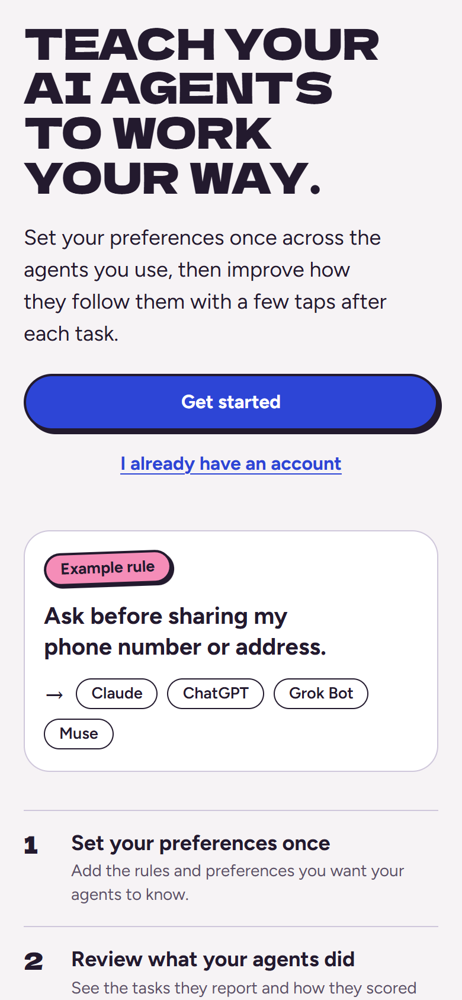
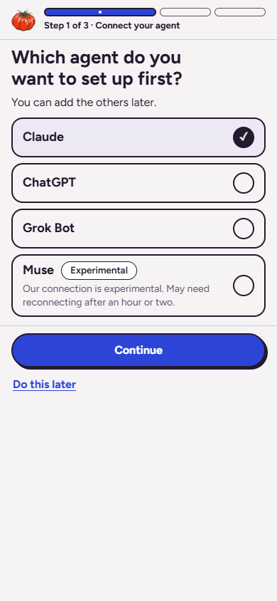
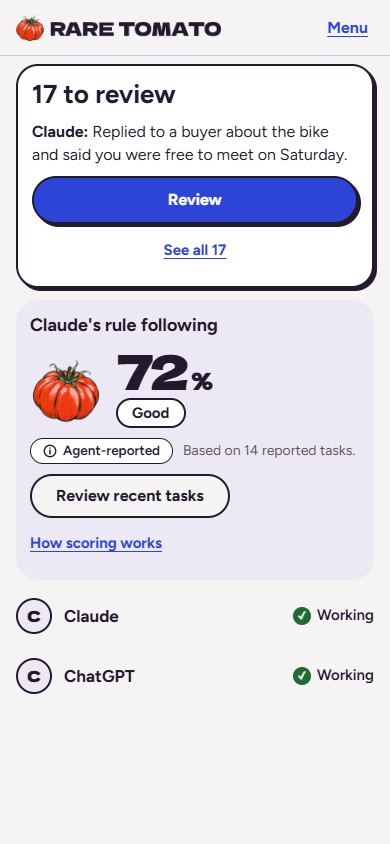

<p align="center">
  <a href="https://raretomato.ai"></a>
</p>

<p align="center">Teach your AI agents to work <em>your</em> way.</p>

<p align="center">
  
  
</p>

<p align="center"><sub><i>Work in progress. Rare Tomato is an early project, and some features may not work yet. Thanks for your patience!</i></sub></p>

## The problem

Personal AI agents often need correcting, even when you've set custom rules. If you use more than one agent, it gets harder to keep up, since your rules and preferences start to drift apart across platforms.

Rare Tomato gives you one master list of rules and preferences that's shared across agents like Claude, ChatGPT, Grok Bot, and Muse. You update it in one place, and every connected agent can check it.

When an agent gets something wrong, you can give it feedback in just a few taps. Those corrections become rules, which helps your agents stay closer to what you've asked.

## How it works

1. **Connect your agents.** Each agent connects to Rare Tomato over [MCP](https://modelcontextprotocol.io), the standard way agents connect to outside tools. A guided setup walks you through it one step at a time.
2. **Add your rules and preferences.** Save your preferences and details once, instead of repeating them in every chat.
3. **Turn corrections into rules.** When an agent gets something wrong, give it a thumbs down. Rare Tomato drafts a rule from what you wrote, and you save it.
4. **Agents check in.** Connected agents can fetch your rules and info, and they log what they did so you can review it later.

## Screenshots

<table>
  <tr>
    <td align="center" width="33%"></td>
    <td align="center" width="33%"></td>
    <td align="center" width="33%"></td>
  </tr>
  <tr>
    <td align="center" valign="top"><b>Landing page.</b> Where you start.</td>
    <td align="center" valign="top"><b>Choose an agent.</b> Pick which agent to connect first.</td>
    <td align="center" valign="top"><b>Rule-following score.</b> See how well your agents follow your rules, and review what they did.</td>
  </tr>
</table>

## Features

- **Rules from corrections.** Give a thumbs down, review the drafted rule, and save it. Saved rules are active right away.
- **Your Rules and Info.** One place to see and edit the rules and facts your agents check.
- **Works with several agents.** Claude, ChatGPT, Grok Bot, and Muse (experimental).
- **Agent Activity.** Agents log their own actions through MCP, so you can review recent tasks in a few clicks.
- **Rule-following score.** You can visualize how often an agent reports following your rules, and suggested next steps for low scores.
- **Guided setup.** One step per screen, a progress rail, deep links to the right settings page, and "Do this later" on every step.
- **Guardrails for sensitive info.** Rare Tomato blocks card numbers, bank account numbers, government IDs, passwords, and API keys when it spots them. The check is best-effort, so please don't enter them. Other sensitive facts ask for your confirmation first.
- **Your data stays yours.** The details you save, your task summaries, and your feedback notes are stored encrypted, and you can delete your data at any time.
- **Open source.** Apache 2.0.

## Supported agents

| Agent | Status | Notes |
| --- | --- | --- |
| Claude | Working | Connects as a custom connector |
| ChatGPT | Working | Connects as a custom MCP app |
| Grok Bot | Working | Connects MCP via chat request |
| Muse | Experimental | Our connection to Muse is experimental and may stop connecting |

## Known limitations

- **Agents decide whether to check Rare Tomato.** A server can't make an agent fetch or follow rules. In early testing, most agents didn't check Rare Tomato on their own, which is why setup includes a one-line starter instruction placed in each agent's own settings.
- **The score is agent-reported.** It reflects what the agent says it did, and it isn't independently verified.
- **The interface is changing quickly.** Screens and wording may look different from one visit to the next.
- **Muse is experimental** and may stop connecting.

## Privacy and your data

- When you give a thumbs down, the text you write is sent to Anthropic so it can draft the rule.
- Rare Tomato is built to reject card numbers, bank account numbers, government IDs, and passwords. The check is best-effort, so please don't enter them.
- You can delete individual rules, details, and task records, or your whole account, at any time.

See the [Privacy](https://raretomato.ai/privacy) and [Terms](https://raretomato.ai/terms) pages for details.

## Tech stack

- MCP server for agent connections
- WorkOS for sign-in
- Neon (Postgres) for storage
- Vercel for hosting
- Next.js (App Router) with React, written in TypeScript

## Getting started

**Use the hosted site.** Visit [raretomato.ai](https://raretomato.ai) and follow the guided setup. Please read the work-in-progress note above first.

**Run it locally.** You need Node 24 and npm.

```bash
git clone https://github.com/liajomartinez/rare-tomato.git
cd rare-tomato
npm install
```

The tests need no accounts or keys. They run against an in-memory database:

```bash
npm test
```

To run the app itself, copy `.env.example` to `.env` and fill in your own values. Never commit `.env`. At minimum you need:

- `DATABASE_URL`: a Postgres database (the app is written for [Neon](https://neon.tech))
- `WORKOS_API_KEY`, `WORKOS_CLIENT_ID`, `WORKOS_COOKIE_PASSWORD` (32 or more random characters) and `NEXT_PUBLIC_WORKOS_REDIRECT_URI`: a [WorkOS AuthKit](https://workos.com) project for sign-in
- `MASTER_KEY`: 32 random bytes in base64, which encrypts stored details (for example `openssl rand -base64 32`)
- `ANTHROPIC_API_KEY`: used to draft rules from feedback

Then create the tables and start the app:

```bash
npm run db:migrate
npm run dev
```

Open http://localhost:3000. Before sending a change, also run `npm run lint` and `npx tsc --noEmit`.

## What's next

- A much simpler, more automated setup for each agent
- A cleaner, more minimal design
- Ideas under consideration include shared orchestration across agents from multiple vendors, if early use shows a need.

## Contributing

Issues and suggestions are welcome. I'm a solo maintainer, so replies may take a little while. If you'd like to send a pull request, please open an issue first so we can talk it through.

## License

Apache 2.0. See the LICENSE file.

## Contact

Questions or feedback? Email support@raretomato.ai.
